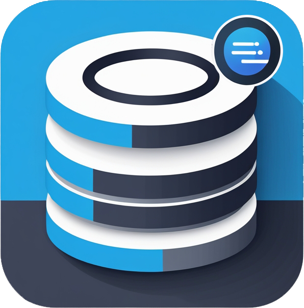

# LocalSQLite.js: Un Manejador de Base de Datos en Memoria

## 📌 Descripción
Una librería en JavaScript puro que funcioná como un motor de base de datos simple. Esta librería permite operaciones básicas de bases de datos utilizando una sintaxis SQL simplificada. La librería es ligera, eficiente y compatible con navegadores modernos, sin depender de bibliotecas externas.



---

## 🚀 Instalación y Uso
Para utilizar **DBEngine**, sigue los siguientes pasos:

### 1️⃣ Creación de la base de datos
```javascript
const db = new DBEngine('usersDB'); // Base de datos de usuarios
const db2 = new DBEngine('cargosDB'); // Otra base de datos
const db3 = new DBEngine('joinDB'); // Base de datos para joins
```
### 2️⃣ Cargar y crear tablas
```javascript
db.load().then(() => {
    db.createTable('users', ['name', 'email', 'age'], 'email'); // 'email' como campo único
});
```
###  3️⃣ Insertar datos en la tabla
```javascript
db.insert('users', { name: 'Milena', email: 'mile@example.com', age: 30 });
db.insert('users', { name: 'Jorge', email: 'jorge@example.com', age: 30 });
db.insert('users', { name: 'Ana', email: 'ana@example.com', age: 25 });
db.insert('users', { name: 'Michael', email: 'mmm@example.com', age: 25 });
```
# 🛠️ Consultas Disponibles
## 🔍 SELECT
### SELECT ALL
```SQL
SELECT * FROM users;
```
```javascript
const results = db.select('users');
results.forEach(record => {
    console.log(`User ID: ${record.id}, Name: ${record.name}, Email: ${record.email}, Age: ${record.age}`);
});
```
### SELECT DISTINCT
```SQL
SELECT DISTINCT name, age FROM users;
```
```javascript
const resultsDistinct = db.select('users', {}, 'AND', ['name', 'age'], {}, ['name', 'age']);
resultsDistinct.forEach(record => {
    console.log(`Name: ${record.name}, Age: ${record.age}`);
});
```
### SELECT ORDER BY ASC
```SQL
SELECT name, age FROM users ORDER BY name ASC;
```
```javascript
const resultsOrdered = db.select('users', {}, 'AND', ['name', 'age'], [{ column: 'name', order: 'ASC' }]);
resultsOrdered.forEach(record => {
    console.log(`Name: ${record.name}, Age: ${record.age}`);
});
```
### SELECT ORDER BY DES
```SQL
SELECT name, age FROM users ORDER BY name DES;
```
```javascript
const resultsOrdered = db.select('users', {}, 'AND', ['name', 'age'], [{ column: 'name', order: 'DES' }]);
resultsOrdered.forEach(record => {
    console.log(`Name: ${record.name}, Age: ${record.age}`);
});
```
### SELECT WHERE
```SQL
SELECT * FROM users WHERE age = 25;
```
```javascript
const resultsWhere = db.select('users', { age: 25 });
resultsWhere.forEach(record => {
    console.log(`User ID: ${record.id}, Name: ${record.name}, Email: ${record.email}, Age: ${record.age}`);
});
```
### SELECT WHERE OR LIKE
```SQL
SELECT * FROM users WHERE age = 25 OR name LIKE "%na%";
```
```javascript
const resultsWherelike = db.select('users', { name: { $like: 'na' }, age: 25 }, 'OR');
resultsWherelike.forEach(record => {
    console.log(`User ID: ${record.id}, Name: ${record.name}, Email: ${record.email}, Age: ${record.age}`);
});

```
### SELECT WHERE AND LIKE
```SQL
SELECT * FROM users WHERE age = 25 AND name LIKE "%na%";
```
```javascript
const resultsWherelike = db.select('users', { name: { $like: 'na' }, age: 25 }, 'AND');
resultsWherelike.forEach(record => {
    console.log(`User ID: ${record.id}, Name: ${record.name}, Email: ${record.email}, Age: ${record.age}`);
});

```

## 🗑️ Uso de DELETE 
### DELETE WHERE
```SQL
DELETE FROM users WHERE id = 3;
```
```javascript
db.delete('users', { id: 3 });
const resultsAfterDelete = db.select('users');
resultsAfterDelete.forEach(record => {
    console.log(`User ID: ${record.id}, Name: ${record.name}, Email: ${record.email}`);
});
```
## 🔗 Uso de JOIN
### JOIN 
```SQL
SELECT users.name, orders.product FROM users INNER JOIN orders ON users.id = orders.userId;
```
```javascript
db3.load().then(() => {
    db3.createTable('users', ['id', 'name', 'age'], 'name');
    db3.createTable('orders', ['id', 'userId', 'product'], 'product');

    db3.insert('users', { name: 'Jorge', age: 30 });
    db3.insert('users', { name: 'Ana', age: 25 });

    db3.insert('orders', { userId: 1, product: 'Laptop' });
    db3.insert('orders', { userId: 2, product: 'Smartphone' });
    db3.insert('orders', { userId: 1, product: 'Headphones' });

    const resultJoin = db3.join('users', 'orders', 'id', 'userId');
    resultJoin.forEach(record => {
        console.log(`Name: ${record.name}, Product: ${record.product}`);
    });
});
```
# 📖 Funcionalidades Implementadas
    ✅ Creación y manipulación de tablas
    ✅ Inserción de registros con claves únicas
    ✅ Consultas SELECT con filtros WHERE
    ✅ Búsquedas con LIKE
    ✅ Ordenación con ORDER BY
    ✅ Eliminación de registros con DELETE
    ✅ Eliminación de duplicados con DISTINCT
    ✅ Soporte para JOIN entre tablas

# 🔧 Próximas Mejoras
🔹 Soporte para UPDATE de registros
🔹 Implementación de transacciones con BEGIN y COMMIT
🔹 Serialización de datos para persistencia en archivos